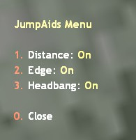
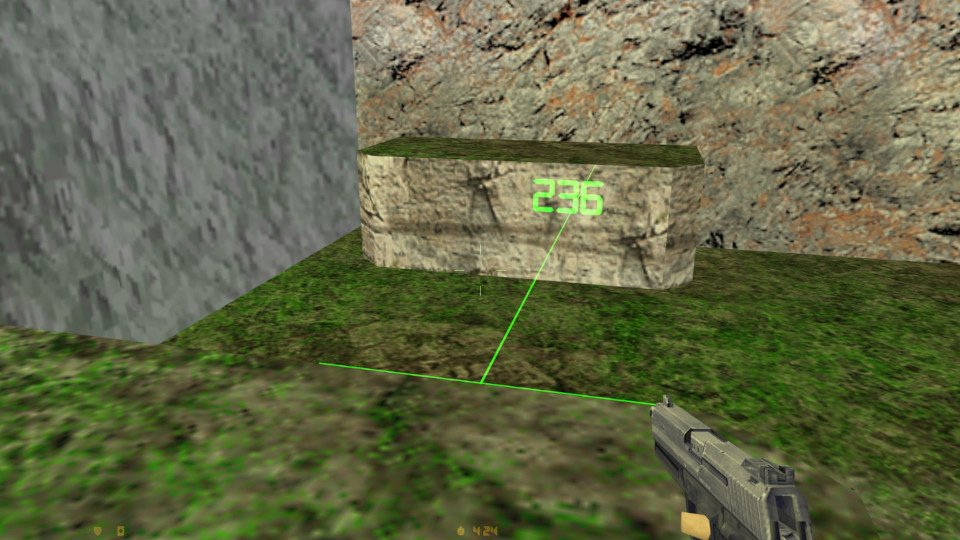
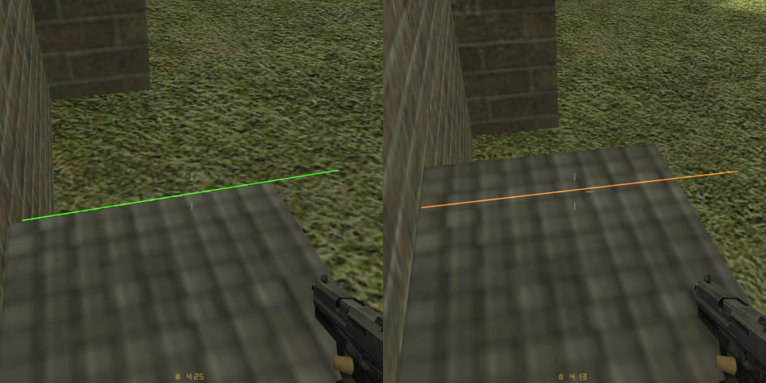
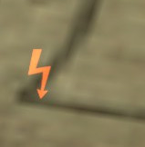

# Jump Aids
Jump helper plugin for Counter-Strike 1.6. Built for [AMX Modx X](www.amxmodx.org) using the Pawn programming language.

Provides visual indicators to aid in Kreedz jumping maps.

Say "/jumpaids" or "/ja" to show the menu. Three aids can be toggled on & off.

## Distance
Casts a ray forward from below the players feet and shows the distance for a straight jump.

## Edge
Draws a line parallel with an edge to indicate where to jump from, whether its a regular jump, or a high jump.

## Headbang
An icon is shown on the HUD when clearance is low, where the player might bang their head when jumping.

